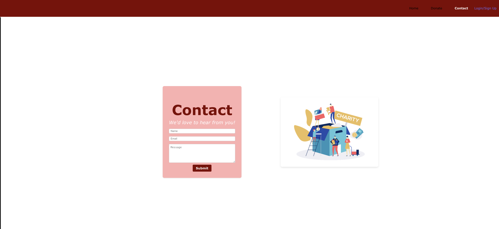

# CharityNOW
MERN one page website for discovering and donating to charities.

## Table of Contents
* [Installation](#installation)
* [Description](#description)
* [Technologies](#technologies)
* [Usage](#usage)
* [Contributions](#contributions)
* [License](#license)
* [Credits](#credits)
* [Tests](#tests)
* [Github](#github)
* [Questions](#questions)

## Installation
To install, please clone this repository to your computer using the following steps in Github:

1. Click the "Code" dropdown menu and copy the SSH URL.
2. Open your terminal and navigate to the directory you would like to clone this repository into.
3. Type "git clone <paste SSH URL>", replacing <paste SSH URL> with your copied SSH URL. You can substitute an SSH URL with an HTTPS URL.
4. Press enter.

## Description
CharityNOW, is a seamless platform where generosity meets simplicity. CharityNOW is a one-page MERN stack website designed to make donating to charities easy and efficient.
 
The inspiration behind CharityNOW stems from the need to simplify charitable donations. Many individuals want to contribute to charitable causes but are deterred by cumbersome and bifurcatec donation processes. By developing CharityNOW, we aim to:
 
1. Enhance Accessibility: Make it easier for people to find and donate to charities from a single, user-friendly platform.
 
2. Encourage Engagement: Provide a space where users can actively participate in charitable activities, including creating their own causes.
 
3. Educate and Inform: Offer detailed information about various charities to help users make informed decisions about their donations.

## Technologies

### React
Utilized for creating a dynamic and responsive front end, enabling a smooth user experience.
### GraphQL 
with Node.js and Express.js
Post/Lgout: Logs out the current user.
### MongoDB and Mongoose ODM
Employed for the database, ensuring robust data storage and retrieval.
### JWT Authentication
Ensured secure user authentication and data protection.
### Render
Used for deploying the application, allowing live access and interaction with real-world data.

Insert Description.

## Usage

After downloading the program per the below, run the following commands in your terminal to open the program:

npm i  
npm seed  
npm run develop

[Link to Deployed Program](https://charitynow.onrender.com/)

Once the program is running, you should see the following home page:

Click "Login/Sign Up" to login or create an account. You can toggle between the appropriate tabs depending on what action you wish to take. To sign up, enter a username, e-mail and password; to login, enter an e-mail and password.

To logout, select the "Click to Logout" button in the navigation bar.

Navigate to the Donate page to see the selection of charities. Click the "More" button under a charity for more information; click "Donate" to donate money. Donation options are $5, $10, $20, or a custom amount. After picking an option, select "Okay" to donate. Note that only logged in users can donate.

Navigate to the Contact page to send us a message. Be sure to include your name, e-mail, and a message body.

## Contributions
When contributing to this repository, please reach out to me via e-mail to discuss the change you would like to make first. I am open to ideas both with regards to data stored in the tables and alterations to user interaction with the data.

## License
This project is licensed under the MIT License. For more information, please see the [MIT License](https://opensource.org/licenses/MIT).

## Credits
This program was created by the group Charitable Coders for the UC Berkeley eDX Coding Boot Camp. The group members are Matt Andrade, Mehrdod Rezvany, Jacob McAuliffe, William Lee, Charles Hutchings, and Stefan Wanigatunga. We also want to thank our TAs who helped temendously throughout the project.

## Tests
In the future, we'd like to further develop this project by creating a profile page for the user. This page would list user details, and track the donations the user has made. Additionally, we'd like to add more organizations to the donate page, and have it populate these groups from the back-end rather than have it all hard-coded to the front-end.

## GitHub Links
Jacob McAuliffe - https://github.com/jacobmca  
Matthew Andrade - https://github.com/mandrade09  
Charlie Hutchings - https://github.com/CharlesHut  
Mehrdod Rezvany - https://github.com/reztndev  
Stefan Wanigatunga - https://github.com/stefanfilm  
William Lee - https://github.com/ItsWillyNilly  

## Questions
If you have further questions about this project, please e-mail [mcauliffemedia@gmail.com](mailto:mcauliffemedia@gmail.com).